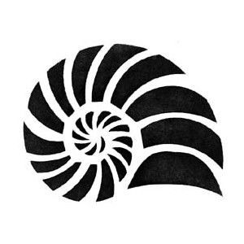
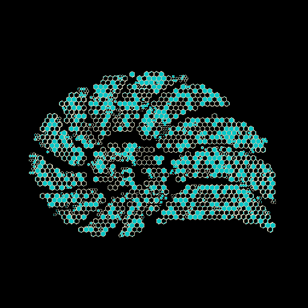
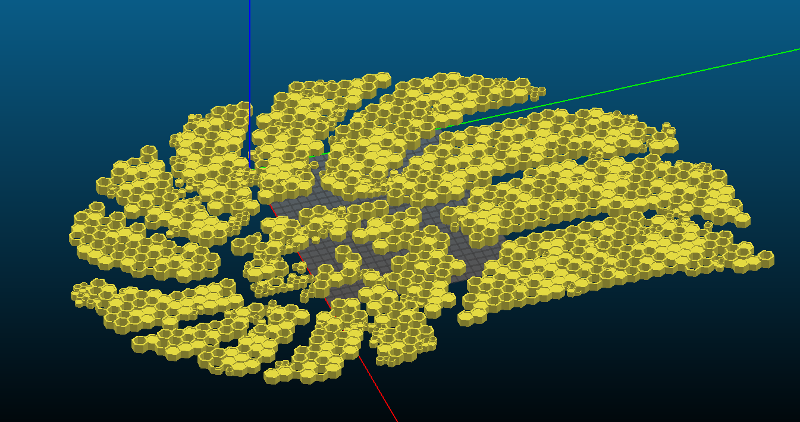

# honeycombs
This is a repo of OpenSCAD and python scripts to generate honeycomb like 3D models given a source image.

|Original Image|3D Preview|
|---|---|
|||

# Use
`$ ./honeycombs.py imageFile [options]`

### Options
|Parameter|Description|
|---|---|
|-p, --preview|Display a visual representation of the converted image to std out.|
|-i, --invert|Invert the grayscale result.|
|-w, --width|Set the target size of the output.|
|-t, --threshold|Set the threshold to use for grayscale clipping (between 0 and 255).|
|-n, --noise|Set the amount of noise to add to the output.|
|-s, --seed|Set the seed to use for noise.|

See the examples folder for examples of use.

**Note**: Exporting models as AMF instead of STL seems to be a requirement if the model is large. How the edges line up directly on faces seems to be break down in STL files to where you will start to see broken models when viewing them in Slic3r.

# Scripts
##### honeycombs.py
This python script requires the imageio and argparse python libraries to run. Its purpose is to create the input for the OpenSCAD scripts as a 2d array. This array is in the format of [[1, 1, 0], [1, 2, 1], [1, 1, 0]] for example. This represents a 3x3 grid of how to render the honeycombs later.
As of now, the data within the array has the following meanings:

|Value|Meaning|
|:---:|---|
|0|No data (hole in resulting model)|
|1|A simple, single hexagon|
|2|Several smaller hexagons filling the space of a single larger hexagon|

These values are determined by the provided image to the script. The provided image is chunked into regions. Each region has an average grayscale value from 0 to 255 (with some intervention via clipping). Regions with an average value from 0 - 179 get assigned a 1. Regions with an average value from 179 to 254 get assigned a 2. The user can specify through the noise option to randomly introduce different average values to each range that has data. This will result in the model having less repetition later.

##### honeycombs.scad
This OpenSCAD script converts the outputted 2d array from the honeycombs.py script into a 3d model of joined up hexagons. Within this script, you can set the size of the hexagons, how likely they are to fill, and how much variation there is in their height.
Use of this script alone without any 2d array input, will render a randomly generated grid of hexagons. You can use this to play around with the various variables within the script.
